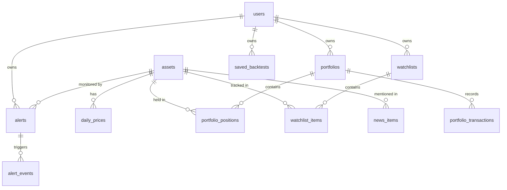

# Data Model

## Entity Relationship Diagram

## Tables

### users
| Column          | Type           | Notes                    |
|-----------------|----------------|--------------------------|
| id              | integer PK     | Auto-increment           |
| email           | varchar(255)   | Unique, indexed          |
| hashed_password | varchar(255)   |                          |
| full_name       | varchar(255)   | Nullable                 |
| is_active       | boolean        | Default true             |
| created_at      | timestamptz    |                          |
| updated_at      | timestamptz    |                          |

### assets
| Column        | Type          | Notes                           |
|---------------|---------------|---------------------------------|
| id            | integer PK    |                                 |
| symbol        | varchar(20)   | Unique, indexed (e.g. VOO)      |
| name          | varchar(255)  |                                 |
| asset_type    | varchar(20)   | stock, etf, crypto              |
| exchange      | varchar(50)   | Nullable                        |
| metadata_json | jsonb         | Nullable, flexible extra fields |

### daily_prices
| Column    | Type          | Notes                               |
|-----------|---------------|-------------------------------------|
| id        | integer PK    |                                     |
| asset_id  | integer FK    | References assets.id, CASCADE       |
| date      | date          | Indexed; unique with asset_id       |
| open      | numeric(14,4) |                                     |
| high      | numeric(14,4) |                                     |
| low       | numeric(14,4) |                                     |
| close     | numeric(14,4) |                                     |
| adj_close | numeric(14,4) |                                     |
| volume    | integer       |                                     |

### portfolios
| Column      | Type         | Notes                      |
|-------------|--------------|----------------------------|
| id          | integer PK   |                            |
| user_id     | integer FK   | References users.id        |
| name        | varchar(255) |                            |
| description | text         | Nullable                   |
| created_at  | timestamptz  |                            |

### portfolio_positions
| Column         | Type           | Notes                      |
|----------------|----------------|----------------------------|
| id             | integer PK     |                            |
| portfolio_id   | integer FK     | References portfolios.id   |
| asset_id       | integer FK     | References assets.id       |
| shares         | numeric(16,6)  |                            |
| avg_cost_basis | numeric(14,4)  |                            |

### portfolio_transactions
| Column       | Type           | Notes                      |
|--------------|----------------|----------------------------|
| id           | integer PK     |                            |
| portfolio_id | integer FK     | References portfolios.id   |
| asset_id     | integer FK     | References assets.id       |
| tx_type      | varchar(10)    | buy or sell                |
| shares       | numeric(16,6)  |                            |
| price        | numeric(14,4)  |                            |
| executed_at  | timestamptz    |                            |

### watchlists
| Column     | Type         | Notes                |
|------------|--------------|----------------------|
| id         | integer PK   |                      |
| user_id    | integer FK   | References users.id  |
| name       | varchar(255) |                      |
| created_at | timestamptz  |                      |

### watchlist_items
| Column       | Type       | Notes                      |
|--------------|------------|----------------------------|
| id           | integer PK |                            |
| watchlist_id | integer FK | References watchlists.id   |
| asset_id     | integer FK | References assets.id       |

### alerts
| Column     | Type           | Notes                            |
|------------|----------------|----------------------------------|
| id         | integer PK     |                                  |
| user_id    | integer FK     | References users.id              |
| asset_id   | integer FK     | References assets.id             |
| alert_type | varchar(30)    | dip_threshold, price_below, etc. |
| threshold  | numeric(10,4)  |                                  |
| message    | text           | Nullable                         |
| is_active  | boolean        | Default true                     |
| created_at | timestamptz    |                                  |

### alert_events
| Column           | Type           | Notes                    |
|------------------|----------------|--------------------------|
| id               | integer PK     |                          |
| alert_id         | integer FK     | References alerts.id     |
| triggered_at     | timestamptz    |                          |
| price_at_trigger | numeric(14,4)  |                          |
| details          | text           | Nullable                 |

### saved_backtests
| Column     | Type        | Notes                    |
|------------|-------------|--------------------------|
| id         | integer PK  |                          |
| user_id    | integer FK  | References users.id      |
| symbol     | varchar(20) |                          |
| parameters | jsonb       | Input params snapshot    |
| results    | jsonb       | Full results snapshot    |
| created_at | timestamptz |                          |

### news_items
| Column          | Type           | Notes                        |
|-----------------|----------------|------------------------------|
| id              | integer PK     |                              |
| asset_id        | integer FK     | Nullable, References assets  |
| headline        | varchar(500)   |                              |
| url             | text           |                              |
| source          | varchar(100)   | Nullable                     |
| sentiment_score | numeric(5,4)   | Nullable, -1.0 to 1.0       |
| published_at    | timestamptz    |                              |
| fetched_at      | timestamptz    |                              |
